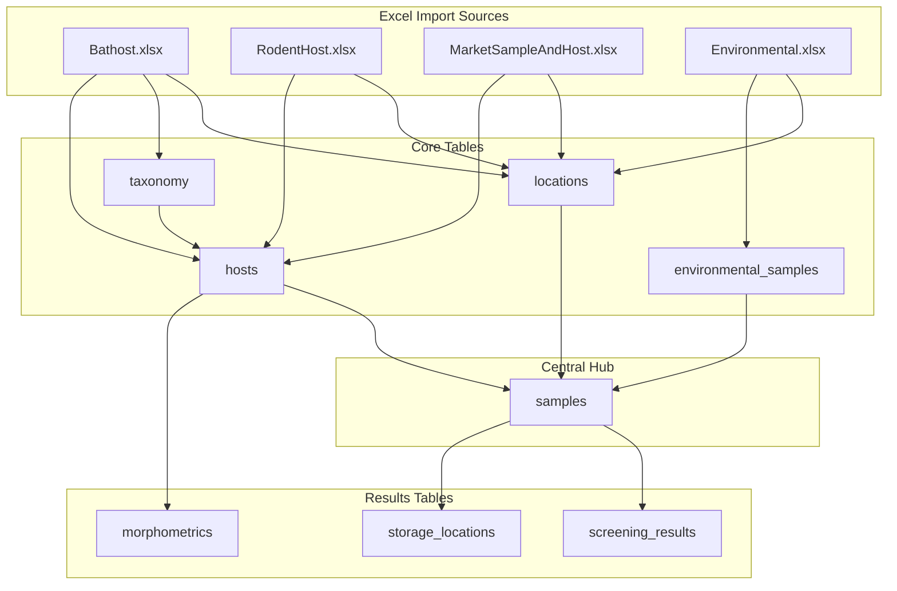

# HaoXai Database Entity Relationship Diagram

## 🗄️ Database Schema ER Diagram


## 🔗 Relationship Flow Diagrams

### **1. Normal Sample Flow (Bat/Rodent/Market)**


### **2. Environmental Sample Flow (FIXED)**


### **3. Complete Data Flow**


## 📊 Table Relationships Summary

### **Primary Keys (PK)**
- `locations.location_id`
- `taxonomy.taxonomy_id`
- `hosts.host_id`
- `environmental_samples.env_sample_id`
- `samples.sample_id`
- `morphometrics.morpho_id`
- `screening_results.screening_id`
- `storage_locations.storage_id`

### **Foreign Keys (FK)**
- `hosts.location_id` → `locations.location_id`
- `hosts.taxonomy_id` → `taxonomy.taxonomy_id`
- `environmental_samples.location_id` → `locations.location_id`
- `samples.host_id` → `hosts.host_id`
- `samples.env_sample_id` → `environmental_samples.env_sample_id`
- `samples.location_id` → `locations.location_id`
- `morphometrics.host_id` → `hosts.host_id`
- `screening_results.sample_id` → `samples.sample_id`

### **Unique Constraints**
- `locations(province, district, village, site_name)`
- `taxonomy.scientific_name`
- `hosts(source_id, host_type)`
- `samples(source_id, sample_origin)`
- `environmental_samples.source_id`
- `screening_results.excel_id`
- `storage_locations(sample_tube_id, rack, spot_position)`

## 🎯 Key Design Features

### **1. Central Sample Hub**
- `samples` table is the central hub for all sample types
- Both `hosts` and `environmental_samples` can create sample records
- All downstream operations (screening, storage) link to `samples`

### **2. Flexible Sample Origins**
```sql
sample_origin IN ('BatSwab','BatTissue','RodentSample','MarketSample','Environmental')
```

### **3. Dual Parent Support**
- `samples.host_id` → for host-derived samples
- `samples.env_sample_id` → for environmental samples
- One will be NULL, the other populated

### **4. Consistent Screening Flow**
- All screening results link to `samples.sample_id`
- No direct links from source tables to screening
- Uniform query patterns for all sample types

## 🔍 Query Examples

### **Find All Sample Types with Locations**
```sql
SELECT 
    s.sample_id,
    s.sample_origin,
    s.source_id,
    l.province,
    l.district,
    CASE 
        WHEN h.host_id IS NOT NULL THEN h.host_type
        WHEN es.env_sample_id IS NOT NULL THEN 'Environmental'
    END as sample_category
FROM samples s
LEFT JOIN hosts h ON s.host_id = h.host_id
LEFT JOIN environmental_samples es ON s.env_sample_id = es.env_sample_id
LEFT JOIN locations l ON s.location_id = l.location_id;
```

### **Complete Sample Profile with Screening**
```sql
SELECT 
    s.sample_id,
    s.sample_origin,
    s.source_id,
    COALESCE(h.field_id, es.source_id) as field_identifier,
    t.scientific_name,
    l.province,
    sr.pan_corona,
    sr.pan_hanta,
    sl.rack_position
FROM samples s
LEFT JOIN hosts h ON s.host_id = h.host_id
LEFT JOIN environmental_samples es ON s.env_sample_id = es.env_sample_id
LEFT JOIN taxonomy t ON (h.taxonomy_id = t.taxonomy_id OR es.env_sample_id IS NOT NULL)
LEFT JOIN locations l ON s.location_id = l.location_id
LEFT JOIN screening_results sr ON s.sample_id = sr.sample_id
LEFT JOIN storage_locations sl ON s.source_id = sl.sample_tube_id;
```

## 📈 Data Volume Estimates

| Table | Estimated Records | Growth Rate |
|-------|-------------------|-------------|
| locations | ~500 | Low |
| taxonomy | ~200 | Low |
| hosts | ~8,000 | Medium |
| environmental_samples | ~100 | Low |
| samples | ~12,000 | High |
| morphometrics | ~8,000 | Medium |
| screening_results | ~15,000 | High |
| storage_locations | ~15,000 | High |

## 🚀 Performance Considerations

### **Indexes Recommended**
- `hosts(source_id, host_type)`
- `samples(source_id, sample_origin)`
- `samples(host_id)`
- `samples(env_sample_id)`
- `screening_results(tested_sample_id)`
- `storage_locations(sample_tube_id)`

### **Query Optimization**
- Central `samples` table enables efficient joins
- Consistent foreign key paths simplify query planning
- Proper indexing ensures fast lookups by sample ID

This ER diagram represents the corrected and optimized database schema with proper environmental sample integration! 🎯

