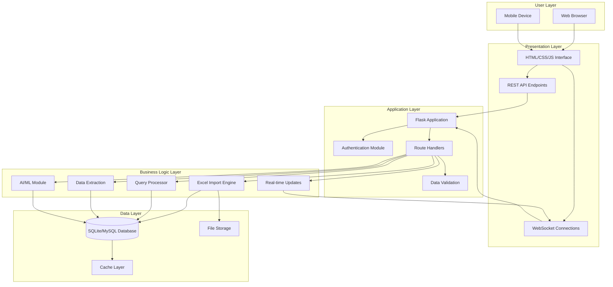
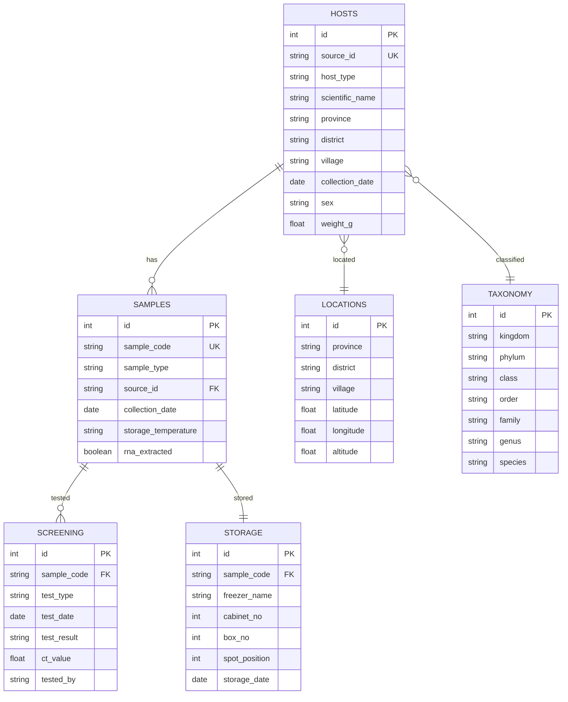
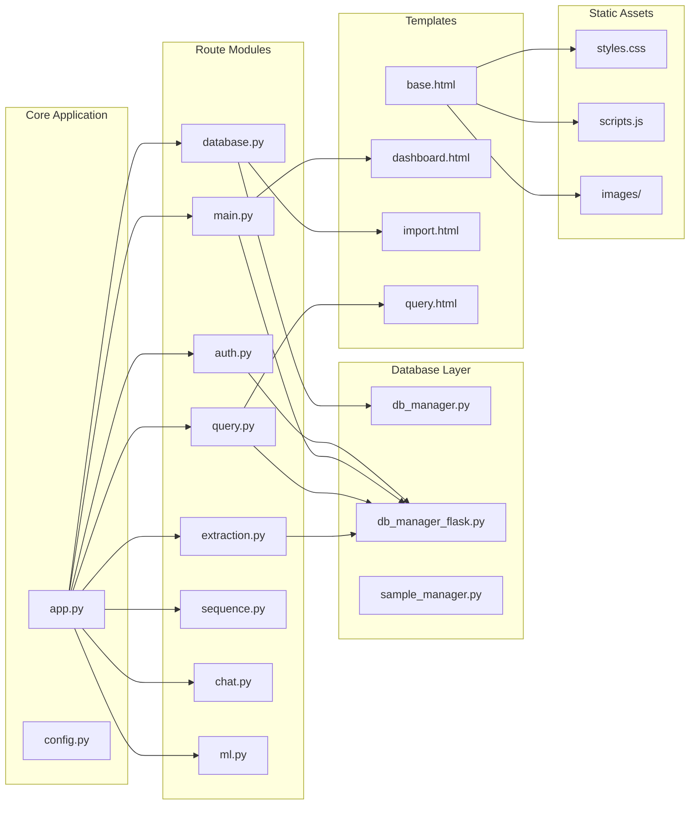
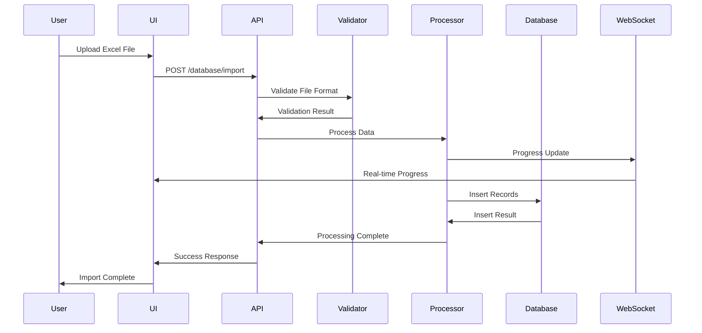
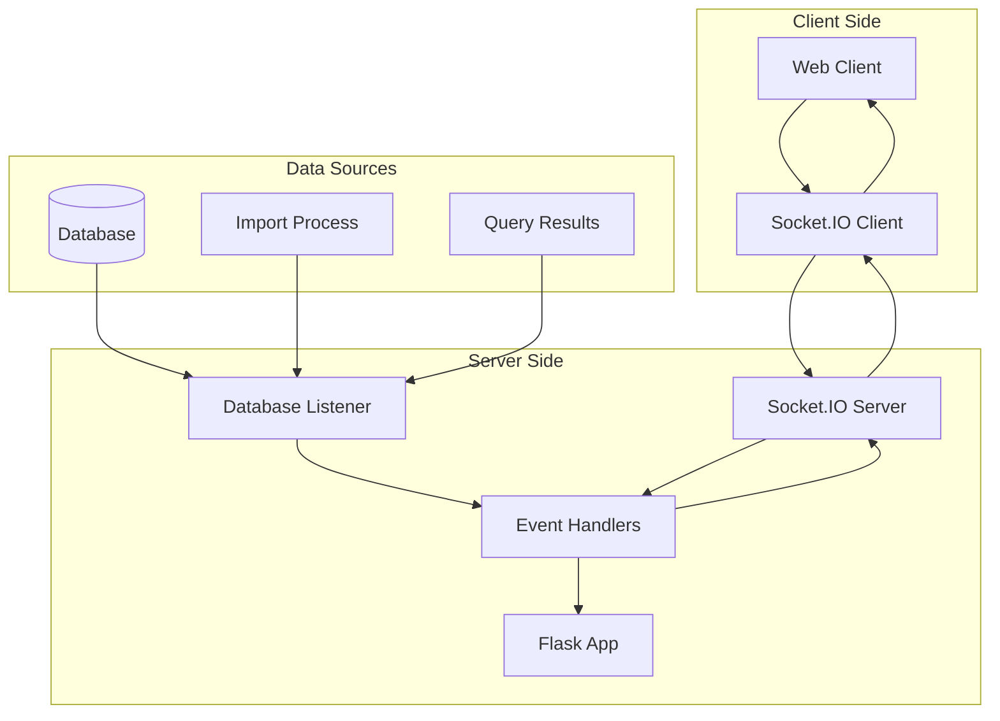
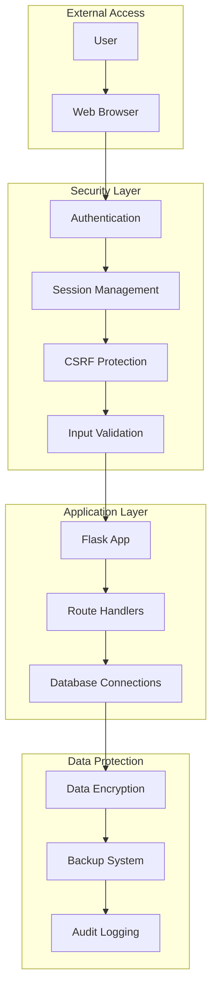
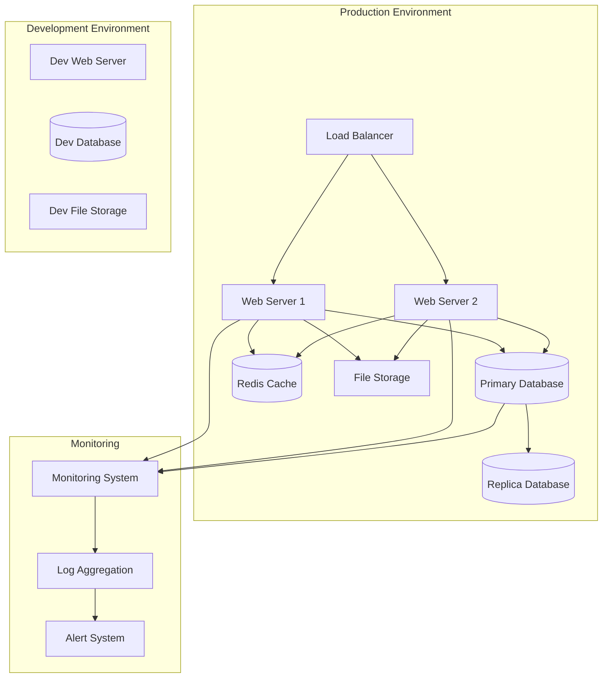
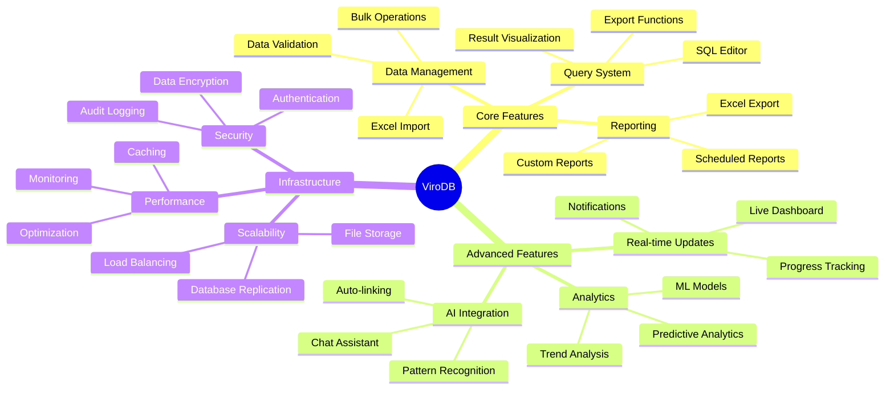

# ViroDB System Architecture Diagrams

## 1. High-Level System Architecture

## 2. Database Schema Architecture

## 3. Application Module Architecture

## 4. Data Flow Architecture

## 5. Real-time Update Architecture

## 6. Security Architecture

## 7. Deployment Architecture

## 8. Feature Module Interactions

---

## Diagram Summary

These architectural diagrams provide visual representations of:

1. **High-Level System Architecture** - Overall system structure and component relationships
2. **Database Schema Architecture** - Entity relationships and data model structure
3. **Application Module Architecture** - Flask application organization and module dependencies
4. **Data Flow Architecture** - Sequence of operations for data processing
5. **Real-time Update Architecture** - WebSocket implementation for live updates
6. **Security Architecture** - Security layers and protection mechanisms
7. **Deployment Architecture** - Production deployment topology
8. **Feature Module Interactions** - Feature relationships and system capabilities

These diagrams complement the written design document and provide visual clarity for understanding the ViroDB system architecture.
